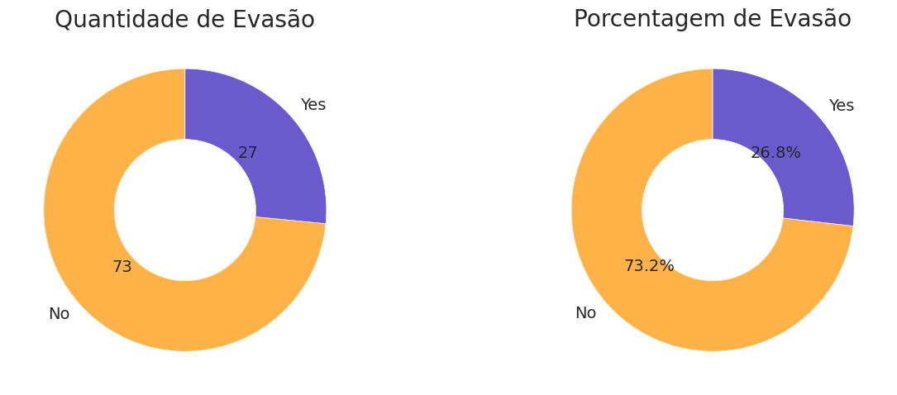
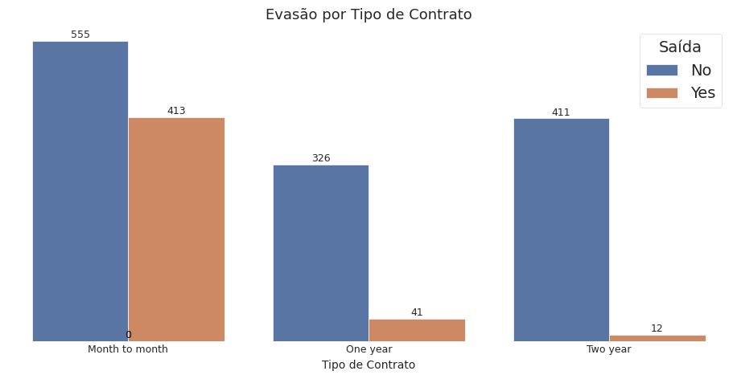
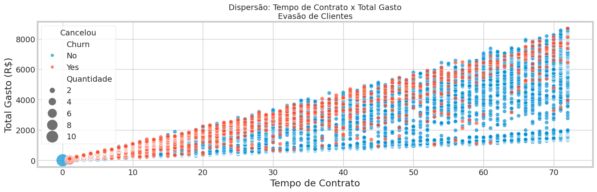
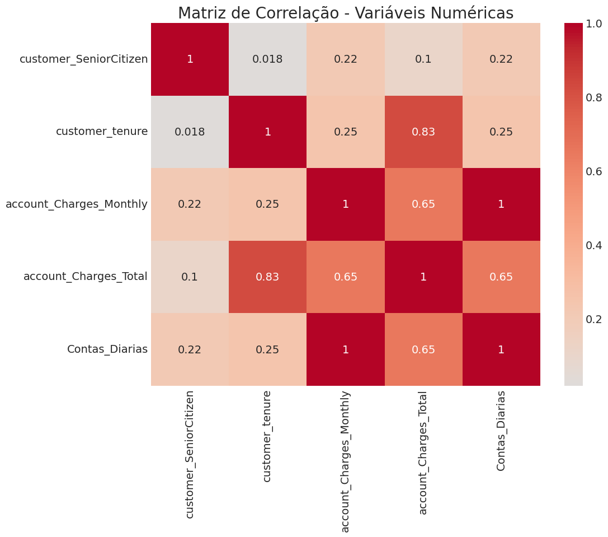

# 📊 Análise da Evasão de Clientes – TelecomX

<h2> 🧠 Sobre o Projeto </h2>

Este projeto tem como objetivo analisar os dados de clientes da empresa **TelecomX**, com foco em entender os fatores que contribuem para a **evasão de clientes (Churn)**.  
Através de análises exploratórias, identificação de padrões e geração de insights, buscamos propor soluções para **reduzir o churn** e **melhorar a retenção de clientes**.

<h2> 🔥 Objetivo </h2>

- 📌 Entender os principais fatores que levam clientes a cancelarem os serviços.
- 📌 Avaliar o perfil dos clientes que mais cancelam.
- 📌 Propor ações estratégicas baseadas em dados.

<h2> 🗂️ Estrutura do Projeto </h2>

- `TelecomX_BR2.ipynb` – Notebook com todo o processo de análise, tratamento dos dados, EDA (Análise Exploratória) e visualizações.

<h2> 🧽 Etapas Realizadas </h2>

<h3> ✅ 1. Limpeza e Tratamento de Dados </h3>

- Remoção e tratamento de dados nulos.
- Conversão de tipos incorretos (ex.: `TotalCharges` de texto para float).
- Criação de variáveis auxiliares, como:
  - Total de gastos (`account_Charges_Total`)
  - Média de gasto diário (`Contas_Diarias`)

<h2> 🔍 Análise Exploratória de Dados </h2>

<h3> 🔸 Distribuição da Evasão </h3>

<h3> 🔸 Evasão por Tipo de Contrato </h3>

<h3> 🔸 Análise de Gasto Total vs Tempo de Contrato </h3>

<h3> 🔸 Matriz de Correlação das Variáveis Numéricas </h3>

<h2> 🏆 Principais Insights </h2>

- Clientes com **contrato mensal têm maior risco de cancelamento**.
- **Tempo de contrato é o fator mais relevante** — quanto mais tempo, menor a chance de evasão.
- Variáveis como **ser idoso (`SeniorCitizen`) têm pouca influência** no churn.
- Forte correlação entre **`customer_tenure` e `account_Charges_Total` (0.83)**.
- **Variáveis redundantes encontradas:** `account_Charges_Monthly` e `Contas_Diarias` (**correlação 1.0**).

<h2> 💡 Conclusões e Recomendações </h2>

- ✔️ Contratos longos (anual/bienal) com descontos ou benefícios.
- ✔️ Programas de fidelização para novos clientes.
- ✔️ Alertas e monitoramento para alto risco de churn.
- ✔️ Simplificar pacotes para aumentar retenção.
- ✔️ Ajustar modelos removendo variáveis redundantes.

<h2> 📊 Tecnologias Utilizadas </h2>

- Python
- Pandas
- NumPy
- Matplotlib
- Seaborn
- Plotly (opcional)
- Google Colab

## ⚠️ Projeto Desenvolvido por:

### Linkedin: https://www.linkedin.com/in/maycon-war-dev-3d/
